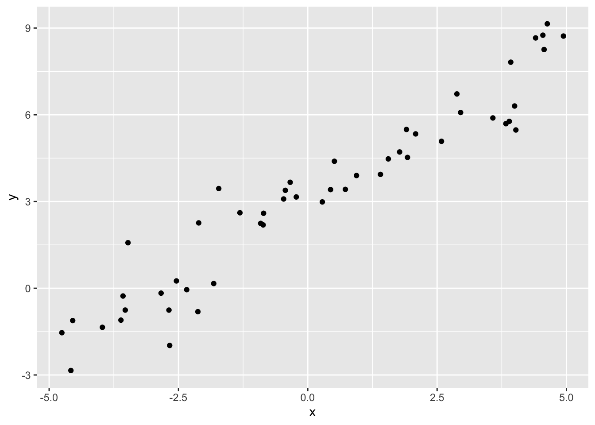

# Giriş

Acaba chatgpt nasıl çalışıyor? Ya da bir araba kendini nasıl sürüyor? Merak ediyor musununz?

Bir tahmin oyunu oynadığınızı varsayalım. Diyelim ki rastgele bir sayı tuttunuz, ve karşınızdaki kişiden bunu tahmin etmesini istiyorsunuz. Her tahminin sonucunda, sayıya olan yakınlığa bağlı olarak yukarı ve aşağı komutları ile yön veriyorsunuz ve yarışmacı belli bir süre sonra sizin aklınızda tuttuğunuz sayıya yaklaşmaya başlıyor.

Acaba ne oldu burada? 

+ Elimizde bir veri var (tahmin edilen sayı)
+ Tahmin yap 
+ Hatanı ölç (tahmin edilen sayıdan az veya fazla bilgisi)
+ Hatanı azaltacak yönde yeni bir tahmini yap
+ Bu şekilde tahmin edilen sayıyı bulana kadar devam et

Tebrikler, makine öğrenmesinin en önemli kavramlarından birisini öğrenmeye başladınız! 

## Projenin amacı

Bu projede, birbiriyle doğrusal ilişkiye sahip iki veri kümesini kullanacaksınız ve bu iki veri seti arasındaki doğrusal ilişkiyi açıklayan modelin parametrelerini, aşamalı azalış isimli bir yöntem ile optimize etmeye çalışacaksınız. 

Ardından geliştirdiğiniz bu yöntemi bir R fonskiyonu haline getirerek, biyolojik bir veri üzerine uygulayacaksınız.

## İçerik

Kullanacağınız basit veri set bir sonraki şekilde görülmektedir.



## Kullanılacak veri

Aşağıda simule edilmiş bir veri bulunmaktadır. Bununla işe başlayalım:

```R
library(ggplot2)
set.seed(123)

x <- runif(50, -5, 5)
y <- x + rnorm(50) + 3
df <- data.frame(y,x)

ggplot(data = df, aes(y=y,x=x)) + geom_point()
```

## Modelin hatasını ölçmek

Peki, şimdi modeleimiz ne kadar başarılı ona bakalım. Önceki örneğimizde tahmin yapmıştık. Bu model aslında $x$ değişkenlerini kullanarak, $y$ değişkenini tahmin etmemizi sağlıyır. Mesela birinci veri noktasona bakalım:

```{r}
df[1,]
```

Peki, şimdi oluşturduğumuz modele göre $x=-2.124225$ verdiğimizde, $y$ ne oluyor ona bakalım. Çok basit bir şekilde $y = \beta_{0} + \beta_{1}*x$ denkleminde, $x=-2.124225$, $\beta_{0} = 0$ ve $\beta_{1} = 0$  parametrelerini yerlerine koyalım:

```{r}

y = 0 + 0 * (-2.124225)
y
```

Evet, y için 0 değerini elde ettik. Peki ne kadar hata yaptık? Tahmin ettiğimiz değerden, gerçek y değerini çıkartıp, mutlak değerini alırsak, hata oranımız öğrenebilriiz:

```{r}
abs(0 - (-2.124225))
```

Bu değer artık (residual) olarak isimlendirilir, ve o noktadaki hata oranımızı temsil eder. Gelin bunu bütün değerler için tekrar ederlim. Önce,  $\beta_{0} = 0$ ve $\beta_{1} = 0$ parameterinei göre oluşturduğumuz doğrusal modelde, $x$ girdilerini kullanarak, $y$ tahmini yapalım ve model üzerinde hataları görselleştirelim:

```{r}
df$y.pred <- 0 + df$x * 0

ggplot(data = df, aes(y=y,x=x)) + geom_point() + geom_segment(aes(xend = x, yend = y.pred)) + geom_abline(intercept = 0, slope = 0, color = "red") 
```

Burada neye dikkat etmeliyiz? Gerçek $y$ değerleri ile tahmin edilen $y$ değerleri arasında çok fark var. Bu aslında bizim modelimizin hatasını göstermekte. Bizim amacımız, işte bu hata oranını minimize eden Beta0 ve beta1 parametlerini tahmin etmek.

## Hata dediğin nedir ki?

```{r}
cost_history <- double()
theta_history <- list()
theta <- matrix(c(0,0), nrow=2)

# add a column of 1's for the intercept coefficient
X <- cbind(1, matrix(x))
alpha <- 0.01

```

```{r}

error <- (X %*% theta - y)
delta <- t(X) %*% error / length(y)
theta <- theta - alpha * delta

delta[1]<10^-6

df$y.pred <- theta[1] + df$x * theta[2]

ggplot(data = df, aes(y=y,x=x)) + geom_point() + geom_segment(aes(xend = x, yend = y.pred)) + geom_abline(intercept = theta[1], slope = theta[2], color = "red")
```


## Kaynak okumalar

- Maliyet fonksiyonu (hata fonksiyonu): [site](https://www.kdnuggets.com/2020/05/5-concepts-gradient-descent-cost-function.html)
- Aşamalı azalış hakında [site](https://analyticslearn.com/gradient-descent-derivation)
- Alex Baecher [site](https://www.alexbaecher.com/post/gradient-descent/)
- Aşamalı azalış matematiği [site](https://towardsdatascience.com/understanding-the-mathematics-behind-gradient-descent-dde5dc9be06e)
- Aşamalı azalış matematiği ikinci [site](https://mccormickml.com/2014/03/04/gradient-descent-derivation/)
- Aşamalı azalış matematiği [video](https://www.youtube.com/watch?v=jc2IthslyzM)

